# 🏠 {{PROJECT_NAME}}

Bem-vindo à documentação oficial do **{{PROJECT_NAME}}** - {{PROJECT_DESCRIPTION}}

## 🎯 **Visão Geral**

Este é o repositório principal do projeto **{{PROJECT_NAME}}**, construído com **WordPress** e uma infraestrutura moderna com Lando para desenvolvimento local. O projeto utiliza tecnologias de ponta para garantir performance, escalabilidade e facilidade de manutenção.

### 📊 **Status do Projeto**
- **Versão Atual**: `{{PROJECT_VERSION}}` ({{CURRENT_DATE}})
- **WordPress**: Customizado com tema {{PROJECT_NAME}}
- **Ambiente**: Multi-ambiente (Local, Development, Staging, Production)
- **Deploy**: Automatizado via GitLab CI/CD + GitFlow

## 🚀 **Quick Start**

### Pré-requisitos
- [Lando](https://lando.dev/) (para desenvolvimento local)
- [Docker](https://docker.com/)
- [Git](https://git-scm.com/)
- [Node.js](https://nodejs.org/) (versão especificada em `.nvmrc`)

### Setup Rápido
```bash
# 1. Clone o repositório
git clone {{GIT_REPO_SSH}}
cd {{PROJECT_NAME}}

# 2. Inicie o ambiente local
lando start

# 3. Configure WordPress
lando ssh -c "scripts/wp-setup.sh --user={{TEAM_EMAIL}}"

# 4. Acesse o site
# Frontend: {{LOCAL_URL}}
# Admin: {{LOCAL_URL}}/wp-admin
```

## 🏗️ **Arquitetura**

```
┌─────────────────┐    ┌─────────────────┐    ┌─────────────────┐    ┌─────────────────┐
│      Local      │────│   Development   │────│     Staging     │────│   Production    │
│ {{LOCAL_URL}}   │    │{{DEVELOPMENT_URL}}│    │ {{STAGING_URL}} │    │{{PRODUCTION_URL}}│
│                 │    │                 │    │                 │    │                 │
└─────────────────┘    └─────────────────┘    └─────────────────┘    └─────────────────┘
         │                       │                       │                       │
         └───────────────────────┼───────────────────────┼───────────────────────┘
                                 │                       │
                    ┌─────────────────┐      ┌─────────────────┐
                    │  GitLab CI/CD   │      │   GitFlow       │
                    │   Pipelines     │      │   + Conventional │
                    └─────────────────┘      └─────────────────┘
```

### 🛠️ **Stack Tecnológico**

| Categoria | Tecnologia |
|-----------|------------|
| **CMS** | WordPress (customizado) |
| **Tema** | {{PROJECT_NAME}} (custom theme) |
| **Frontend** | PHP, JavaScript, Sass, Gutenberg Blocks |
| **Containerização** | Docker, Lando |
| **CI/CD** | GitLab CI/CD |
| **Git Workflow** | GitFlow + Conventional Commits |
| **Code Quality** | PHP_CodeSniffer, ESLint, Prettier |
| **Testing** | PHPUnit, Jest |
| **Documentation** | Docsify |

## 📁 **Estrutura do Projeto**

```
{{PROJECT_NAME}}/
├── 📂 wp-content/                # WordPress content
│   ├── 📂 themes/{{PROJECT_NAME}}/  # Tema principal
│   ├── 📂 plugins/                  # Plugins WordPress
│   └── 📂 mu-plugins/               # Must-use plugins
├── 📂 scripts/                  # Scripts de automação
│   ├── 📄 wp-setup.sh           # Configuração WordPress
│   └── 📄 sage-setup.sh         # Setup Sage (se aplicável)
├── 📂 docs/                     # Documentação do projeto
├── 📂 .gitlab/                  # Templates GitLab CI/CD
├── 📂 .github/                  # Templates GitHub
├── 📂 .husky/                   # Git hooks
├── 📄 .lando.yml               # Configuração ambiente local
├── 📄 .gitlab-ci.yml           # Pipeline CI/CD
├── 📄 package.json             # Dependências Node.js
├── 📄 composer.json            # Dependências PHP
└── 📄 CHANGELOG.md             # Histórico de mudanças
```

## 🌍 **Ambientes**

| Ambiente | URL | Branch | Finalidade |
|----------|-----|--------|------------|
| **Local** | `{{LOCAL_URL}}` | `feature/*` | Desenvolvimento local |
| **Development** | `{{DEVELOPMENT_URL}}` | `development` | Testes contínuos |
| **Staging** | `{{STAGING_URL}}` | `staging` | Homologação |
| **Production** | `{{PRODUCTION_URL}}` | `master` | Site oficial |

## 🔄 **Workflow de Desenvolvimento**

```mermaid
graph LR
    A[Feature Branch] --> B[Pull Request]
    B --> C[Code Review]
    C --> D[Merge to Development]
    D --> E["🚀 {{DEVELOPMENT_URL}}"]
    E --> F[Merge to Staging]
    F --> G["🔍 {{STAGING_URL}}"]
    G --> H[Tests + QA]
    H --> I[Merge to Master]
    I --> J["✅ {{PRODUCTION_URL}}"]
```



## 📚 **Documentação Principal**

### 🚀 **Para Desenvolvedores**
- [Getting Started](docs/GettingStarted) - Setup completo do ambiente
- [Development](docs/Development) - Guias de desenvolvimento
- [Architecture](docs/Architecture) - Estrutura técnica detalhada
- [Pipelines](docs/Pipelines) - Processo de CI/CD

### 🔧 **Para DevOps**
- [Infrastructure](docs/Infrastructure) - Infraestrutura e deploy
- [Monitoring](docs/Monitoring) - Monitoramento e observabilidade
- [Troubleshooting](docs/Troubleshooting) - Resolução de problemas

### 📦 **Para Gestão**
- [Changelog](CHANGELOG.md) - Histórico de versões
- [CODEOWNERS](.github/CODEOWNERS) - Responsabilidades

## 🆘 **Precisa de Ajuda?**

### 🐛 **Problemas Comuns**
- [Troubleshooting](docs/Troubleshooting) - Guia de resolução
- [FAQ](docs/FAQ) - Perguntas frequentes

### 📞 **Contatos**
- **Equipe**: {{TEAM_EMAIL}}
- **Issues**: [GitLab Issues]({{GIT_REPO_URL}}/-/issues)
- **Documentation**: [Wiki]({{GIT_REPO_URL}}/-/wikis)

## 🎯 **Links Importantes**

| Recurso | Link | Ambiente |
|---------|------|----------|
| **Site Produção** | [{{PRODUCTION_URL}}]({{PRODUCTION_URL}}) | 🔴 Production |
| **Site Staging** | [{{STAGING_URL}}]({{STAGING_URL}}) | 🟡 Staging |
| **Site Development** | [{{DEVELOPMENT_URL}}]({{DEVELOPMENT_URL}}) | 🟠 Development |
| **Site Local** | [{{LOCAL_URL}}]({{LOCAL_URL}}) | 🔵 Local |
| **GitLab Project** | [{{GIT_REPO_URL}}]({{GIT_REPO_URL}}) | - |
| **CI/CD Pipelines** | [Pipelines]({{GIT_REPO_URL}}/-/pipelines) | - |

## 🚀 **Comandos Essenciais**

### Lando (Desenvolvimento Local)
```bash
# Iniciar ambiente
lando start

# Parar ambiente
lando stop

# Reconstruir ambiente
lando rebuild

# Acessar container
lando ssh
```

### Git Workflow
```bash
# Criar nova feature
git checkout -b feature/nova-funcionalidade

# Commit seguindo Conventional Commits
git commit -m "feat: add new functionality"

# Push e criar Merge Request
git push origin feature/nova-funcionalidade
```

### WordPress via Lando
```bash
# WP-CLI (todas as ferramentas dentro do container)
lando wp --help
lando wp user list
lando wp plugin list

# Logs
lando logs
```

---

📝 **Última atualização**: {{CURRENT_DATE}}
🔄 **Versão da documentação**: {{PROJECT_VERSION}}
✨ **Criado com**: Setup automatizado + Conventional Commits
🌐 **Ambientes configurados**: Local, Development, Staging, Production