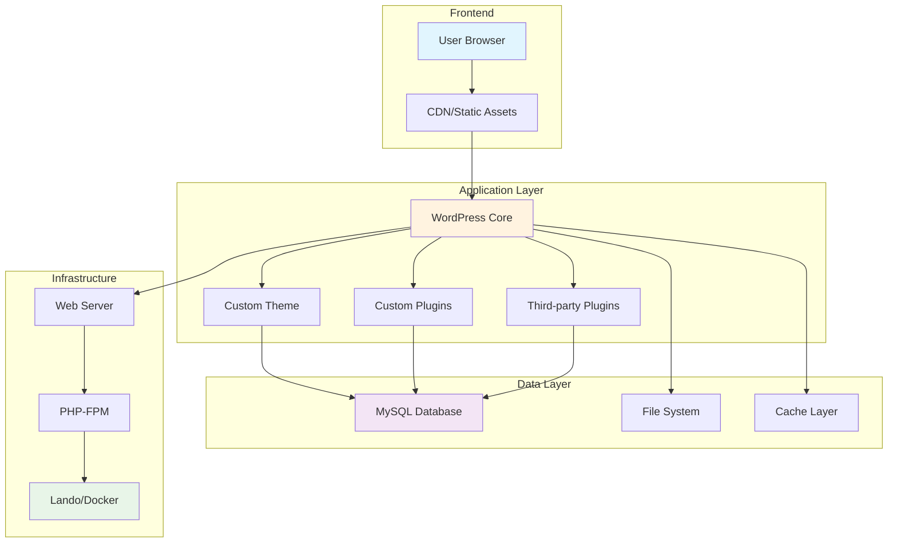

# 🏗️ Architecture

Guia completo da arquitetura técnica do projeto **{{PROJECT_NAME}}**, com foco na estrutura, componentes e decisões de design.

## 🎯 **Visão Geral**

O projeto **{{PROJECT_NAME}}** é construído sobre **WordPress** com uma arquitetura moderna que prioriza performance, escalabilidade e facilidade de manutenção.

### **Principais Características**
- **WordPress Core**: Customizado e otimizado
- **Tema Custom**: Desenvolvido especificamente para o projeto
- **Plugins Selecionados**: Apenas os essenciais
- **Containerização**: Lando para desenvolvimento local
- **CI/CD**: GitLab Pipelines automatizados
- **Git Workflow**: GitFlow + Conventional Commits

## 🏗️ **Arquitetura Geral**



## 📁 **Estrutura do Projeto**

### **Estrutura de Diretórios**

```
{{PROJECT_NAME}}/
├── 📂 wp-content/                    # Conteúdo WordPress
│   ├── 📂 themes/{{PROJECT_NAME}}/   # Tema customizado
│   │   ├── 📂 assets/                # CSS, JS, imagens
│   │   │   ├── 📂 css/
│   │   │   ├── 📂 js/
│   │   │   └── 📂 images/
│   │   ├── 📂 inc/                   # Includes PHP
│   │   ├── 📂 template-parts/        # Template parts
│   │   ├── 📂 functions.php          # Functions do tema
│   │   ├── 📂 style.css              # Estilo principal
│   │   ├── 📂 index.php              # Template principal
│   │   └── 📂 screenshot.png         # Screenshot do tema
│   ├── 📂 plugins/                   # Plugins WordPress
│   │   └── 📂 {{PROJECT_NAME}}-plugin/ # Plugin customizado
│   └── 📂 mu-plugins/                # Must-use plugins
├── 📂 scripts/                       # Scripts de automação
│   ├── 📄 wp-setup.sh               # Setup WordPress
│   └── 📄 sage-setup.sh             # Setup Sage (se aplicável)
├── 📂 config/                        # Configurações
│   └── 📄 php.ini                   # Configuração PHP
├── 📂 db_init/                       # Inicialização do banco
├── 📂 docs/                          # Documentação
├── 📂 .gitlab/                       # Templates GitLab CI/CD
├── 📂 .github/                       # Templates GitHub
├── 📂 .husky/                        # Git hooks
├── 📄 .lando.yml                    # Configuração Lando
├── 📄 .gitlab-ci.yml                # Pipeline CI/CD
├── 📄 wp-config.php                 # Configuração WordPress
├── 📄 package.json                  # Dependências Node.js
├── 📄 composer.json                 # Dependências PHP
└── 📄 README.md                     # Documentação principal
```

### **Estrutura do Tema**

```
wp-content/themes/{{PROJECT_NAME}}/
├── 📂 assets/                        # Assets do tema
│   ├── 📂 css/                       # Estilos CSS/SCSS
│   │   ├── 📂 components/            # Componentes
│   │   ├── 📂 layouts/               # Layouts
│   │   ├── 📂 pages/                 # Páginas específicas
│   │   └── 📄 main.scss              # Arquivo principal
│   ├── 📂 js/                        # JavaScript
│   │   ├── 📂 components/            # Componentes JS
│   │   ├── 📂 utils/                 # Utilitários
│   │   └── 📄 main.js                # Arquivo principal
│   └── 📂 images/                    # Imagens do tema
├── 📂 inc/                           # Includes PHP
│   ├── 📂 customizer/                # Customizer
│   ├── 📂 widgets/                   # Widgets customizados
│   ├── 📂 shortcodes/                # Shortcodes
│   └── 📄 setup.php                  # Setup do tema
├── 📂 template-parts/                # Template parts
│   ├── 📂 content/                   # Conteúdo
│   ├── 📂 navigation/                # Navegação
│   └── 📂 components/                # Componentes
├── 📂 page-templates/                # Templates de página
├── 📂 woocommerce/                   # Templates WooCommerce (se aplicável)
├── 📄 functions.php                  # Functions do tema
├── 📄 index.php                      # Template principal
├── 📄 header.php                     # Header
├── 📄 footer.php                     # Footer
├── 📄 sidebar.php                    # Sidebar
├── 📄 single.php                     # Single post
├── 📄 page.php                       # Page template
├── 📄 archive.php                    # Archive template
├── 📄 search.php                     # Search template
├── 📄 404.php                        # 404 template
├── 📄 style.css                      # Estilo principal
└── 📄 screenshot.png                 # Screenshot do tema
```

## 🔧 **Componentes Principais**

### **WordPress Core**

**Versão**: WordPress 6.x
**Características**:
- Core customizado para performance
- Configurações otimizadas
- Segurança reforçada
- Cache otimizado

### **Tema Customizado**

**Nome**: {{PROJECT_NAME}}
**Características**:
- Desenvolvido especificamente para o projeto
- Responsivo e acessível
- Otimizado para performance
- SEO-friendly
- Compatível com Gutenberg

### **Plugins Essenciais**

| Plugin | Finalidade | Status |
|--------|------------|--------|
| **Yoast SEO** | Otimização SEO | Ativo |
| **WP Rocket** | Cache e performance | Ativo |
| **Wordfence** | Segurança | Ativo |
| **UpdraftPlus** | Backup | Ativo |
| **{{PROJECT_NAME}}-plugin** | Funcionalidades customizadas | Ativo |

### **Plugin Customizado**

```
wp-content/plugins/{{PROJECT_NAME}}-plugin/
├── 📂 includes/                      # Classes e funções
│   ├── 📂 admin/                     # Admin interface
│   ├── 📂 public/                    # Frontend
│   ├── 📂 api/                       # REST API
│   └── 📂 core/                      # Core functionality
├── 📂 assets/                        # CSS, JS do plugin
├── 📂 languages/                     # Traduções
├── 📂 templates/                     # Templates do plugin
├── 📄 {{PROJECT_NAME}}-plugin.php    # Arquivo principal
├── 📄 uninstall.php                  # Desinstalação
└── 📄 readme.txt                     # Documentação
```

## 🌐 **Ambientes**

### **Desenvolvimento Local (Lando)**

```yaml
# .lando.yml
name: {{PROJECT_NAME}}
recipe: wordpress
config:
  webroot: .
  database: mysql:8.0
  php: '8.1'
  via: nginx
  ssl: true

services:
  database:
    type: mysql:8.0
    portforward: true
    creds:
      user: root
      password: password
      database: wordpress

tooling:
  wp:
    service: appserver
    description: Run WP-CLI commands
  composer:
    service: appserver
    description: Run Composer commands
  npm:
    service: appserver
    description: Run NPM commands
```

### **Ambientes de Deploy**

| Ambiente | URL | Branch | Finalidade |
|----------|-----|--------|------------|
| **Local** | `{{LOCAL_URL}}` | `feature/*` | Desenvolvimento |
| **Development** | `{{DEVELOPMENT_URL}}` | `develop` | Validação |
| **Staging** | `{{STAGING_URL}}` | `staging` | QA |
| **Production** | `{{PRODUCTION_URL}}` | `main` | Site oficial |

## 🗄️ **Banco de Dados**

### **Estrutura MySQL**

```sql
-- Tabelas principais do WordPress
wp_posts          -- Posts, páginas, custom post types
wp_postmeta       -- Metadados dos posts
wp_users          -- Usuários
wp_usermeta       -- Metadados dos usuários
wp_comments       -- Comentários
wp_commentmeta    -- Metadados dos comentários
wp_terms          -- Termos de taxonomias
wp_termmeta       -- Metadados dos termos
wp_term_relationships -- Relacionamentos
wp_term_taxonomy  -- Taxonomias
wp_options        -- Opções do WordPress
wp_links          -- Links (legado)

-- Tabelas customizadas (se aplicável)
wp_{{PROJECT_NAME}}_custom_table
```

### **Otimizações de Banco**

- **Índices otimizados** para consultas frequentes
- **Cache de consultas** via Redis/Memcached
- **Limpeza automática** de dados desnecessários
- **Backup automatizado** diário

## ⚡ **Performance**

### **Estratégias de Cache**

```php
// Cache de consultas
wp_cache_set('key', $data, 'group', 3600);
$data = wp_cache_get('key', 'group');

// Cache de objetos
wp_cache_add_object_cache();

// Cache de páginas
wp_cache_add_page_cache();
```

### **Otimizações de Assets**

```javascript
// Webpack configuration
module.exports = {
  entry: './assets/js/main.js',
  output: {
    filename: '[name].[contenthash].js',
    path: path.resolve(__dirname, 'dist')
  },
  optimization: {
    splitChunks: {
      chunks: 'all'
    }
  }
};
```

### **Lazy Loading**

```php
// Lazy loading de imagens
function add_lazy_loading($content) {
    return preg_replace('//', '', $content);
}
add_filter('the_content', 'add_lazy_loading');
```

## 🔒 **Segurança**

### **Medidas de Segurança**

1. **Autenticação Forte**
   - Senhas complexas obrigatórias
   - Autenticação de dois fatores
   - Limite de tentativas de login

2. **Proteção de Arquivos**
   - Arquivos sensíveis fora do webroot
   - Permissões de arquivo restritas
   - Proteção contra acesso direto

3. **Validação de Dados**
   - Sanitização de inputs
   - Validação de formulários
   - Escape de outputs

4. **Monitoramento**
   - Logs de segurança
   - Alertas de atividades suspeitas
   - Scans de vulnerabilidades

### **Configurações de Segurança**

```php
// wp-config.php
define('DISALLOW_FILE_EDIT', true);
define('DISALLOW_FILE_MODS', true);
define('FORCE_SSL_ADMIN', true);
define('WP_AUTO_UPDATE_CORE', true);
```

## 📱 **Responsividade**

### **Breakpoints**

```scss
// Breakpoints do tema
$mobile: 480px;
$tablet: 768px;
$desktop: 1024px;
$large: 1200px;
$xl: 1440px;

// Mixins responsivos
@mixin mobile {
  @media (max-width: $mobile) {
    @content;
  }
}

@mixin tablet {
  @media (min-width: $tablet) {
    @content;
  }
}
```

### **Grid System**

```scss
// Grid flexível
.grid {
  display: grid;
  grid-template-columns: repeat(auto-fit, minmax(300px, 1fr));
  gap: 2rem;
}

// Container responsivo
.container {
  max-width: 1200px;
  margin: 0 auto;
  padding: 0 1rem;

  @include mobile {
    padding: 0 0.5rem;
  }
}
```

## 🔧 **Integrações**

### **APIs Externas**

```php
// Exemplo de integração com API
class ExternalAPI {
    private $api_key;
    private $base_url;

    public function __construct() {
        $this->api_key = get_option('external_api_key');
        $this->base_url = 'https://api.external.com';
    }

    public function get_data($endpoint) {
        $response = wp_remote_get($this->base_url . $endpoint, [
            'headers' => [
                'Authorization' => 'Bearer ' . $this->api_key
            ]
        ]);

        return wp_remote_retrieve_body($response);
    }
}
```

### **Webhooks**

```php
// Webhook para sincronização
add_action('wp_ajax_webhook_sync', 'handle_webhook_sync');
function handle_webhook_sync() {
    // Processar dados do webhook
    $data = json_decode(file_get_contents('php://input'), true);

    // Atualizar dados locais
    update_option('synced_data', $data);

    wp_die('OK');
}
```

## 📊 **Monitoramento**

### **Métricas de Performance**

- **Page Load Time**: < 2 segundos
- **Time to First Byte**: < 500ms
- **Lighthouse Score**: > 90
- **Core Web Vitals**: Pass

### **Logs e Debugging**

```php
// Logging customizado
function custom_log($message, $level = 'info') {
    if (WP_DEBUG_LOG) {
        error_log(sprintf('[%s] %s: %s',
            date('Y-m-d H:i:s'),
            strtoupper($level),
            $message
        ));
    }
}
```

## 📚 **Recursos Adicionais**

### **Documentação**
- [WordPress Developer Handbook](https://developer.wordpress.org/)
- [WordPress Coding Standards](https://developer.wordpress.org/coding-standards/)
- [WordPress Theme Handbook](https://developer.wordpress.org/themes/)

### **Ferramentas**
- [WP-CLI](https://wp-cli.org/) - Command line interface
- [PHP_CodeSniffer](https://github.com/squizlabs/PHP_CodeSniffer) - Padrões de código
- [Lighthouse](https://developers.google.com/web/tools/lighthouse) - Performance

---

📝 **Última atualização**: {{CURRENT_DATE}}
🔄 **Versão**: {{PROJECT_VERSION}}
✨ **Arquitetura**: WordPress + Lando + GitFlow