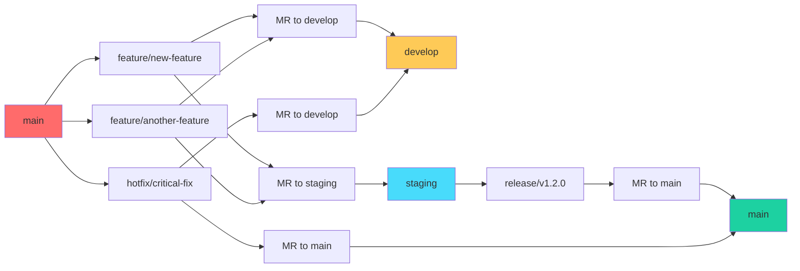

# 💻 Development

Guia completo de desenvolvimento para o projeto **{{PROJECT_NAME}}**, com foco em qualidade, padrões e boas práticas profissionais.

## 🌊 **Git Workflow (GitFlow)**

### **Estratégia de Branching**

Nossa estratégia é baseada no **GitFlow**, com uma modificação importante: **todas as branches são criadas a partir da `main`** para garantir que features em desenvolvimento não sejam levadas acidentalmente para produção.



### **Tipos de Branches**

| Branch Type | Prefixo | Origem | Destino | Merge Via | Finalidade |
|-------------|---------|--------|---------|-----------|------------|
| **Feature** | `feature/` | `main` | `develop` + `staging` | **MR** | Novas funcionalidades |
| **Bugfix** | `bugfix/` | `main` | `develop` + `staging` | **MR** | Correções não-críticas |
| **Hotfix** | `hotfix/` | `main` | `main` + `develop` + `staging` | **MR** | Correções críticas |
| **Release** | `release/` | `main` | `main` | **MR** | Preparação de releases |
| **Chore** | `chore/` | `main` | `develop` + `staging` | **MR** | Manutenção, docs, etc. |

### **Nomenclatura de Branches**
#### TODO verificar possibilidade de utilizar ids das issues como nome das branchs?
```bash
# ✅ Correto (sempre em inglês)
feature/user-authentication
feature/payment-integration
bugfix/header-responsive-issue
hotfix/critical-security-patch
release/v1.2.0
chore/update-dependencies

# ❌ Incorreto
feature/autenticacao-usuario
feature/NewFeature
bugfix/bug_fix
feature-payment
```

## 🔄 **Workflow de Desenvolvimento**

### **1. Criando uma Nova Feature**

```bash
# 1. Sempre partir da main atualizada
git checkout main
git pull origin main

# 2. Criar branch seguindo padrão
git checkout -b feature/user-profile-enhancement

# 3. Desenvolver com commits bem documentados
git add .
git commit -m "feat: add user profile avatar upload functionality"

# 4. Push da branch
git push origin feature/user-profile-enhancement
```

### **2. Fluxo de Merge Requests (Processo Obrigatório)**

```mermaid
graph TD
    A[Feature Branch] --> B[MR to develop]
    A --> C[MR to staging]

    B --> D[Code Review develop]
    D --> E{Approved?}
    E -->|No| F[Address Feedback]
    F --> D
    E -->|Yes| G[✅ Merge to develop]
    G --> H[Auto Deploy to {{DEVELOPMENT_URL}}]

    C --> I[Code Review staging]
    I --> J{Approved?}
    J -->|No| K[Address Feedback]
    K --> I
    J -->|Yes| L[QA Testing]
    L --> M{QA Approved?}
    M -->|No| N[Address QA Feedback]
    N --> L
    M -->|Yes| O[✅ Merge to staging]
    O --> P[Deploy to {{STAGING_URL}}]

    P --> Q[Features suficientes aprovadas?]
    Q -->|No| R[Continuar desenvolvimento]
    Q -->|Yes| S[Criar branch release/* from staging]
    S --> T[Release Please processa]
    T --> U[Gera changelog, bump version]
    U --> V[MR automático: release/* → main]
    V --> W[Revisão obrigatória]
    W --> X{Review Approved?}
    X -->|No| Y[Address Feedback]
    Y --> W
    X -->|Yes| Z[✅ Merge to main]
    Z --> AA[Deploy manual para {{PRODUCTION_URL}}]
    AA --> BB[Release Please cria tag automaticamente]

    style G fill:#1dd1a1
    style O fill:#1dd1a1
    style Z fill:#1dd1a1
```

### **3. Processo de Release (Via Release Please)**

| Etapa | Ação |
|-------|------|
| ✅ Dev cria branch a partir de main | `git checkout -b feature/nova-funcionalidade` |
| ✅ Dev faz merge e push para develop e valida | `git push origin feature/nova-funcionalidade` → MR para `develop` |
| ✅ Dev cria pull request da branch feature para staging | MR: `feature/*` → `staging` |
| ✅ Code review | Revisão de código obrigatória |
| ✅ QA | Testes de qualidade e aceitação |
| ✅ Criamos a release branch | `git checkout staging && git checkout -b release/v1.2.0` |
| ✅ Realizamos o merge de todas as features aprovadas para a release | Incluindo hotfixes e outros |
| ✅ Release Please gera changelogs etc | Processamento automático |
| ✅ Pull request aberto da release para a main | MR: `release/*` → `main` |
| ✅ Aprovação - push - deploy | Deploy manual para produção |

```bash
# 1. Desenvolvimento de features
git checkout main
git pull origin main
git checkout -b feature/nova-funcionalidade

# Desenvolver e commitar
git add .
git commit -m "feat: add new functionality"
git push origin feature/nova-funcionalidade

# 2. MR para develop (validação)
# Via GitLab: Create MR feature/* → develop
# Code review e merge

# 3. MR para staging (QA)
# Via GitLab: Create MR feature/* → staging
# Code review + QA + merge

# 4. Quando há features suficientes, criar release
git checkout staging
git pull origin staging
git checkout -b release/v1.2.0

# 5. Release Please processa automaticamente
# - Gera changelog baseado em Conventional Commits
# - Bump version number
# - Cria MR automático para main

# 6. Revisão e merge do MR release/* → main
# 7. Deploy manual para produção
# 8. Tag criada automaticamente pelo Release Please
```

### **4. Processo de Hotfix (Via Merge Requests)**

```bash
# 1. Criar hotfix a partir da main
git checkout main
git pull origin main
git checkout -b hotfix/critical-security-patch

# 2. Implementar correção crítica
git add .
git commit -m "fix: patch critical security vulnerability in user authentication"
git push origin hotfix/critical-security-patch

# 3. DUAS Merge Requests simultâneas (OBRIGATÓRIO)
#
# MR 1: hotfix → main (para produção imediata)
# - Create MR: hotfix/critical-security-patch → main
# - Assign senior reviewers
# - Mark as URGENT
# - Merge after approval
#
# MR 2: hotfix → develop (para sincronização)
# - Create MR: hotfix/critical-security-patch → develop
# - Assign reviewers
# - Merge after MR 1 is completed
```

## 📋 **Merge Request Guidelines**

### **Template de Merge Request**

```markdown
## 🎯 Merge Request Title
Brief description of changes

## 📝 Description
Detailed description of what this MR does and why.

## 🔗 Related Issues
- Closes #123
- Relates to #456

## 🧪 Testing
- [ ] Unit tests pass
- [ ] Integration tests pass
- [ ] Manual testing completed
- [ ] Code review completed

## 📋 Checklist
- [ ] Code follows project standards
- [ ] Documentation updated (if needed)
- [ ] No breaking changes (or documented)
- [ ] Performance impact assessed
```

### **Code Review Checklist**

- [ ] **Funcionalidade**: O código faz o que deveria fazer?
- [ ] **Qualidade**: O código segue os padrões do projeto?
- [ ] **Testes**: Há testes adequados?
- [ ] **Documentação**: A documentação foi atualizada?
- [ ] **Performance**: Há impacto na performance?
- [ ] **Segurança**: Há vulnerabilidades de segurança?

## 📝 **Conventional Commits**

### **Estrutura do Commit**

```bash
<type>[optional scope]: <description>

[optional body]

[optional footer(s)]
```

### **Tipos de Commit**

| Tipo | Descrição | Exemplo |
|------|-----------|---------|
| `feat` | Nova funcionalidade | `feat: add user authentication` |
| `fix` | Correção de bug | `fix: resolve login issue` |
| `docs` | Documentação | `docs: update README` |
| `style` | Formatação | `style: format code with prettier` |
| `refactor` | Refatoração | `refactor: improve user service` |
| `test` | Testes | `test: add unit tests for auth` |
| `chore` | Manutenção | `chore: update dependencies` |
| `perf` | Performance | `perf: optimize database queries` |
| `ci` | CI/CD | `ci: update pipeline configuration` |
| `build` | Build | `build: update webpack config` |

### **Exemplos de Commits**

```bash
# ✅ Bons exemplos
feat: add user profile avatar upload functionality
fix: resolve responsive layout issue on mobile devices
docs: update development workflow documentation
refactor: improve WordPress theme structure
test: add unit tests for user authentication
chore: update PHP dependencies

# ❌ Maus exemplos
add new feature
fix bug
update docs
refactor code
```

### **Commits com Escopo**

```bash
# Commits específicos para WordPress
feat(theme): add custom header component
fix(plugin): resolve compatibility issue with WooCommerce
docs(api): update REST API documentation
refactor(core): improve database query performance
```

## 🛠️ **Ferramentas de Desenvolvimento**

### **Code Quality**

```bash
# PHP CodeSniffer (dentro do container)
lando composer lint
lando composer lint:fix

# JavaScript/ESLint
lando npm run lint
lando npm run lint:fix

# Prettier
lando npm run format
```

### **Testing**

```bash
# PHP Unit Tests
lando composer test

# JavaScript Tests
lando npm test
lando npm run test:watch
```

### **Build Process**

```bash
# Build para produção
lando npm run build

# Build para desenvolvimento
lando npm run dev

# Watch mode
lando npm run watch
```

## 📁 **Estrutura de Desenvolvimento**

### **WordPress Theme Development**

```
wp-content/themes/{{PROJECT_NAME}}/
├── 📂 assets/              # CSS, JS, imagens
│   ├── 📂 css/
│   ├── 📂 js/
│   └── 📂 images/
├── 📂 inc/                 # Includes PHP
├── 📂 template-parts/      # Template parts
├── 📂 functions.php        # Functions do tema
├── 📂 style.css           # Estilo principal
├── 📂 index.php           # Template principal
└── 📂 screenshot.png      # Screenshot do tema
```

### **Plugin Development**

```
wp-content/plugins/{{PROJECT_NAME}}-plugin/
├── 📂 includes/           # Classes e funções
├── 📂 admin/              # Admin interface
├── 📂 public/             # Frontend
├── 📂 assets/             # CSS, JS
├── 📂 languages/          # Traduções
└── 📄 {{PROJECT_NAME}}-plugin.php
```

## 🔧 **Configuração de Desenvolvimento**

### **VS Code Settings**

O projeto inclui configurações específicas para desenvolvimento:

```json
{
  "php.suggest.basic": false,
  "php.validate.enable": true,
  "php.executablePath": "/usr/local/bin/php",
  "emmet.includeLanguages": {
    "php": "html"
  }
}
```

### **Git Hooks (Husky)**

Hooks automáticos configurados:

- **pre-commit**: Linting e formatação
- **commit-msg**: Validação de Conventional Commits
- **pre-push**: Testes automáticos

### **Environment Variables**

```bash
# .env.local (não versionado)
WP_DEBUG=true
WP_DEBUG_LOG=true
WP_DEBUG_DISPLAY=false
```

## 🚀 **Deploy Process**

### **Development**
- **Trigger**: Merge para `develop`
- **Automático**: Deploy via GitLab CI/CD
- **URL**: {{DEVELOPMENT_URL}}

### **Staging**
- **Trigger**: Merge para `staging`
- **Automático**: Deploy via GitLab CI/CD
- **URL**: {{STAGING_URL}}

### **Production**
- **Trigger**: Merge para `main` (via release branch)
- **Manual**: Aprovação obrigatória
- **URL**: {{PRODUCTION_URL}}

## 📚 **Recursos Adicionais**

### **Documentação**
- [WordPress Developer Handbook](https://developer.wordpress.org/)
- [GitFlow Workflow](https://nvie.com/posts/a-successful-git-branching-model/)
- [Conventional Commits](https://www.conventionalcommits.org/)
- [Release Please](https://github.com/googleapis/release-please)

### **Ferramentas**
- [WP-CLI](https://wp-cli.org/) - Command line interface para WordPress
- [PHP_CodeSniffer](https://github.com/squizlabs/PHP_CodeSniffer) - Padrões de código PHP
- [ESLint](https://eslint.org/) - Linting JavaScript

---

📝 **Última atualização**: {{CURRENT_DATE}}
🔄 **Versão**: {{PROJECT_VERSION}}
✨ **Workflow**: GitFlow + Conventional Commits + Release Please