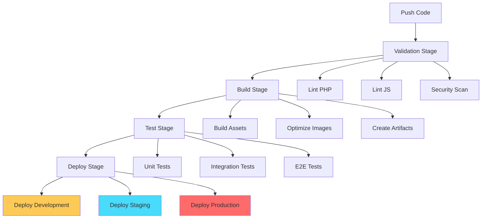

# 🚀 Pipelines

Guia completo dos pipelines CI/CD do projeto **{{PROJECT_NAME}}**, com foco em automação, qualidade e deploy seguro.

## 🎯 **Visão Geral**

Nossos pipelines são baseados em **GitLab CI/CD** e seguem o fluxo GitFlow, garantindo qualidade de código, testes automatizados e deploy seguro em múltiplos ambientes.

### **Arquitetura dos Pipelines**



## 🌍 **Ambientes e Triggers**

### **Development**
- **Trigger**: Push para `develop`
- **Automático**: Deploy imediato
- **URL**: {{DEVELOPMENT_URL}}
- **Finalidade**: Validação contínua de features

### **Staging**
- **Trigger**: Merge para `staging`
- **Automático**: Deploy após aprovação
- **URL**: {{STAGING_URL}}
- **Finalidade**: QA e homologação

### **Production**
- **Trigger**: Merge para `main` (via release branch)
- **Manual**: Aprovação obrigatória
- **URL**: {{PRODUCTION_URL}}
- **Finalidade**: Site oficial

## 📋 **Stages do Pipeline**

### **1. Validation Stage**

```yaml
validation:
  stage: validate
  script:
    - composer lint
    - npm run lint
    - npm run security-check
```

**Jobs incluídos:**
- **PHP CodeSniffer**: Valida padrões de código PHP
- **ESLint**: Valida padrões de código JavaScript
- **Security Scan**: Verifica vulnerabilidades conhecidas
- **Conventional Commits**: Valida formato dos commits

### **2. Build Stage**

```yaml
build:
  stage: build
  script:
    - npm run build
    - composer install --no-dev --optimize-autoloader
    - php artisan config:cache
```

**Jobs incluídos:**
- **Asset Build**: Compila CSS, JS e otimiza imagens
- **Dependency Install**: Instala dependências de produção
- **Cache Optimization**: Otimiza caches do WordPress
- **Artifact Creation**: Cria artefatos para deploy

### **3. Test Stage**

```yaml
test:
  stage: test
  script:
    - composer test
    - npm test
    - npm run test:e2e
```

**Jobs incluídos:**
- **Unit Tests**: Testes unitários PHP
- **Integration Tests**: Testes de integração
- **E2E Tests**: Testes end-to-end
- **Performance Tests**: Testes de performance

### **4. Deploy Stage**

```yaml
deploy:
  stage: deploy
  script:
    - ./scripts/deploy.sh
  when: manual
  only:
    - main
```

**Jobs incluídos:**
- **Deploy Development**: Automático para `develop`
- **Deploy Staging**: Automático para `staging`
- **Deploy Production**: Manual para `main`

## 🔄 **Fluxo de Deploy Integrado**

### **Feature Development**


### **Release Process**
1. **Criação da Release**: Branch `release/*` criada a partir de `staging`
2. **Release Please**: Processa automaticamente changelog e versioning
3. **MR Automático**: `release/*` → `main` criado automaticamente
4. **Revisão**: Code review obrigatório
5. **Deploy**: Manual após aprovação

### **Hotfix Process**
1. **Criação**: Branch `hotfix/*` criada a partir de `main`
2. **Desenvolvimento**: Correção crítica implementada
3. **MRs Simultâneas**:
   - `hotfix/*` → `main` (produção imediata)
   - `hotfix/*` → `develop` (sincronização)
4. **Deploy**: Automático para produção após aprovação

## 🛠️ **Configuração dos Pipelines**

### **GitLab CI/CD (.gitlab-ci.yml)**

```yaml
# Configuração base do pipeline
stages:
  - validate
  - build
  - test
  - deploy

variables:
  PHP_VERSION: "8.1"
  NODE_VERSION: "18"
  COMPOSER_CACHE_DIR: ".composer-cache"
  NPM_CACHE_DIR: ".npm-cache"

# Cache para otimizar builds
cache:
  paths:
    - .composer-cache/
    - .npm-cache/
    - node_modules/
    - vendor/
```

### **Environment Variables**

```bash
# Variáveis de ambiente necessárias
DB_HOST=localhost
DB_NAME=wordpress
DB_USER=root
DB_PASSWORD=password

WP_ENV=development
WP_DEBUG=true
WP_DEBUG_LOG=true

# URLs dos ambientes
DEVELOPMENT_URL={{DEVELOPMENT_URL}}
STAGING_URL={{STAGING_URL}}
PRODUCTION_URL={{PRODUCTION_URL}}
```

## 🔧 **Scripts de Deploy**

### **Deploy Script (scripts/deploy.sh)**

```bash
#!/bin/bash
# Script de deploy automatizado

set -e

ENVIRONMENT=$1
DEPLOY_PATH="/var/www/html"

echo "🚀 Deploying to $ENVIRONMENT..."

# Backup do ambiente atual
if [ -d "$DEPLOY_PATH" ]; then
    echo "📦 Creating backup..."
    tar -czf "backup-$(date +%Y%m%d-%H%M%S).tar.gz" "$DEPLOY_PATH"
fi

# Deploy dos arquivos
echo "📁 Deploying files..."
rsync -av --delete dist/ "$DEPLOY_PATH/"

# Configuração do WordPress
echo "⚙️ Configuring WordPress..."
wp core install --path="$DEPLOY_PATH" --url="$ENVIRONMENT_URL" --title="{{PROJECT_NAME}}" --admin_user=admin --admin_password=admin --admin_email={{TEAM_EMAIL}}

# Limpeza de cache
echo "🧹 Clearing caches..."
wp cache flush --path="$DEPLOY_PATH"

echo "✅ Deploy completed successfully!"
```

### **Rollback Script (scripts/rollback.sh)**

```bash
#!/bin/bash
# Script de rollback em caso de problemas

set -e

BACKUP_FILE=$1
DEPLOY_PATH="/var/www/html"

echo "🔄 Rolling back to $BACKUP_FILE..."

# Restaurar backup
tar -xzf "$BACKUP_FILE" -C /

# Limpar caches
wp cache flush --path="$DEPLOY_PATH"

echo "✅ Rollback completed successfully!"
```

## 📊 **Monitoramento e Alertas**

### **Health Checks**

```yaml
health_check:
  stage: test
  script:
    - curl -f {{DEVELOPMENT_URL}}/health
    - curl -f {{STAGING_URL}}/health
    - curl -f {{PRODUCTION_URL}}/health
  allow_failure: true
```

### **Performance Monitoring**

```yaml
performance_test:
  stage: test
  script:
    - npm run lighthouse
    - npm run webpagetest
  artifacts:
    reports:
      junit: performance-results.xml
```

### **Security Scanning**

```yaml
security_scan:
  stage: validate
  script:
    - npm audit
    - composer audit
    - php security-checker.phar security:check composer.lock
```

## 🚨 **Tratamento de Falhas**

### **Pipeline Failure Handling**

```yaml
# Configuração de retry para jobs que podem falhar
.retry_config: &retry_config
  retry:
    max: 2
    when:
      - runner_system_failure
      - stuck_or_timeout_failure
```

### **Rollback Automático**

```yaml
# Rollback automático em caso de falha no deploy
rollback:
  stage: deploy
  script:
    - ./scripts/rollback.sh $BACKUP_FILE
  when: on_failure
  only:
    - main
```

## 📈 **Métricas e Relatórios**

### **Coverage Reports**

```yaml
coverage_report:
  stage: test
  script:
    - composer test --coverage-html coverage/
  coverage: '/Total:\s+(\d+\.\d+)%/'
  artifacts:
    reports:
      coverage_report:
        coverage_format: cobertura
        path: coverage/cobertura-coverage.xml
```

### **Performance Reports**

```yaml
performance_report:
  stage: test
  script:
    - npm run build:analyze
  artifacts:
    reports:
      bundle_analyzer: bundle-analyzer-report.html
```

## 🔐 **Segurança**

### **Secret Management**

```yaml
# Uso de variáveis seguras do GitLab
deploy_production:
  stage: deploy
  script:
    - echo $PRODUCTION_DB_PASSWORD | base64 -d
  only:
    - main
  when: manual
```

### **Access Control**

```yaml
# Controle de acesso por ambiente
deploy_production:
  stage: deploy
  script:
    - ./scripts/deploy.sh production
  only:
    - main
  when: manual
  allow_failure: false
  rules:
    - if: $CI_COMMIT_BRANCH == "main"
      when: manual
      allow_failure: false
```

## 📚 **Recursos Adicionais**

### **Documentação**
- [GitLab CI/CD Documentation](https://docs.gitlab.com/ee/ci/)
- [WordPress Deployment Best Practices](https://developer.wordpress.org/advanced-administration/deployment/)
- [Release Please Documentation](https://github.com/googleapis/release-please)

### **Ferramentas**
- [GitLab CI/CD](https://gitlab.com/features/gitlab-ci-cd) - Pipeline automation
- [Release Please](https://github.com/googleapis/release-please) - Automated releases
- [Lighthouse](https://developers.google.com/web/tools/lighthouse) - Performance monitoring

---

📝 **Última atualização**: {{CURRENT_DATE}}
🔄 **Versão**: {{PROJECT_VERSION}}
✨ **Pipeline**: GitLab CI/CD + Release Please